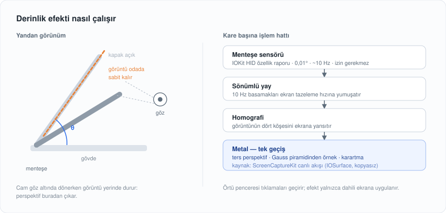
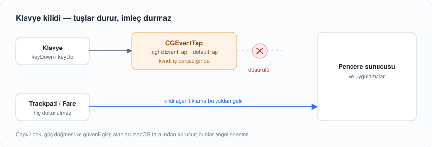

<div align="center">

# MacDuoTR

**MacBook kapağını kapatırken ekranın arkanda kaldığını görün.**

Kapak kapanırken ekran içeriği geriye yatar, bulanıklaşır ve söner —
sanki görüntü camda değil, odada asılı duruyormuş gibi.
Üstüne, klavyeyi temizlerken tuşları kilitleyen bir temizlik modu.

Menü çubuğunda durur. Türkçe ve İngilizce.

[](https://www.apple.com/macos/)
[](https://swift.org)
[](#)
[](LICENSE)

</div>

---

## Kurulum

1. [**Son sürümü indirin**](https://github.com/YusufEmreYazici/MacDuoTR/releases/latest) — `MacDuoTR.zip`
2. Çıkan `MacDuoTR.app`'i **Uygulamalar** klasörüne sürükleyin
3. Çift tıklayın

Hepsi bu. Uygulama menü çubuğuna bir dizüstü bilgisayar simgesi koyar; ayarlar,
klavye kilidi ve izinler oradan yönetilir.

> **İlk açılışta macOS "geliştirici doğrulanamadı" derse:** Sistem Ayarları →
> Gizlilik ve Güvenlik'i açın, aşağı inin ve **"Yine de Aç"** düğmesine basın.
> Uygulama Apple Geliştirici Programı üyeliğiyle imzalanmadığı için macOS bunu
> bir kez sorar.

---

## Ne yapıyor

### Derinlik efekti

Kapağı kapatmaya başlayın: ekrandaki her şey menteşeye tutturulmuş bir yaprak
gibi geriye yatar, uzak kenardan başlayarak bulanıklaşır ve söner. Kapağı geri
açın, görüntü düzlüğüne oturur.

<div align="center">
  
</div>

Açı, MacBook'un menteşe sensöründen okunur — Apple'ın dahili yönelim
sensörünün HID özellik raporlarından, hiçbir izin gerektirmeden. Sensör
saniyede ~10 örnek verir; aradaki basamaklar sönümlü bir yayla ekran tazeleme
hızına yumuşatılır, yani 120 Hz'de bile takılma görmezsiniz.

Görüntü ScreenCaptureKit ile canlı yakalanır ve doğrudan `IOSurface` üzerinden
Metal dokusuna sarılır — tek bir piksel kopyalanmaz. Perspektif, Gauss
bulanıklığı ve karartma tek bir parça gölgelendiricisinde, tek geçişte çizilir.

### Klavye kilidi — temizlik modu

Klavyeyi silerken tuşlara basmak istemiyorsunuz. Menü çubuğundan tek düğme:
klavye durur, **trackpad ve fare çalışmaya devam eder.**

<div align="center">
  
</div>

Kilitliyken ekranda büyük bir panel durur ve kilidi oradan açarsınız. **Süre
yok, geri sayım yok** — siz tıklayana kadar kilitli kalır. Menü çubuğu simgesi
de değişir ve oradan da açabilirsiniz; yani her zaman iki çıkış yolu vardır.

Yakalayıcı kendi iş parçacığında çalışır. Bu bir ayrıntı değil: `.defaultTap`
her tuş vuruşunu uygulamadan geçirir, yakalayıcı arayüzle aynı iş parçacığında
dururken bir çizim işi araya girerse macOS geri çağırmayı yavaş sayıp
yakalayıcıyı kapatır — tuşlar sızar ve kilit güvenilmez olur.

**Engellenemeyenler:** Caps Lock ve güç düğmesi sürücü seviyesinde işlenir;
parola alanları açıkken macOS "güvenli giriş" moduna geçer ve tuş vuruşlarını
hiçbir uygulamaya göstermez. Bunlar macOS'un koyduğu sınırlar.

**Güvenlik ağı:** Uygulama çökerse ya da askıda kalırsa yakalayıcı da onunla
ölür ve macOS klavyeyi kendiliğinden geri verir. Uykuya geçişte ve uygulamadan
çıkışta kilit zaten açılır.

---

## Ayarlar

Menü çubuğu simgesine tıklayın.

| Bölüm | Ne ayarlanır |
|---|---|
| **Klavye kilidi** | Kilitle / aç · medya ve fonksiyon tuşları da engellensin mi |
| **Başlangıç** | Efektin başladığı açı · tam güce kaç derecede ulaşacağı · zaman aşımı |
| **Görünüm** | Bulanıklık yarıçapı ve yayılımı · karartma miktarı ve yayılımı |
| **Perspektif** | Geriye yatma oranı · göz mesafesine göre perspektif gücü |
| **Uygulama** | Dil (Türkçe / İngilizce / sistem) · menü çubuğunda açı · girişte başlat |

**Önizle** düğmesi, kapağı kıpırdatmadan efekti bir kez oynatır — ayarları
denerken işinizi görür.

### İzinler

Uygulama gerektiğinde sorar ve Sistem Ayarları'nın doğru bölümünü kendisi açar.

| İzin | Ne için |
|---|---|
| **Ekran ve Ses Kaydı** | Derinlik efektinin ekran içeriğini çizmesi |
| **Erişilebilirlik** | Klavye kilidi |

> Ekran Kaydı iznini uygulama çalışırken verirseniz, macOS o süreci reddedilmiş
> saymayı sürdürür. Uygulama bunu fark eder ve panelde tek tıkla yeniden
> başlatan bir düğme gösterir.

---

## Gereksinimler

- **macOS 14** veya üstü
- Derinlik efekti için **kapak açısı sensörü olan bir MacBook.** Sensör yoksa
  uygulama bunu söyler; klavye kilidi yine de çalışır
- Apple Silicon ve Intel

Efekt yalnızca dahili ekrana uygulanır. Örtü tıklamaları geçirir, yani
altındaki uygulamaları kullanmaya devam edebilirsiniz.

---

## Gizlilik

Uygulama hiçbir veri toplamaz, hiçbir ağ bağlantısı kurmaz. Ayarlar bu
Mac'te, `UserDefaults` içinde durur. Yakalanan ekran kareleri yalnızca GPU
belleğinde yaşar; diske yazılmaz, hiçbir yere gönderilmez.

---

<details>
<summary><strong>Kaynaktan derlemek</strong></summary>

Xcode (Swift 6+) gerekir.

```sh
git clone https://github.com/YusufEmreYazici/MacDuoTR.git
cd MacDuoTR
./kur.sh
```

`kur.sh` derler, imzalar, `/Applications` altına kurar ve başlatır.
`./kur.sh --paket` dağıtılabilir bir `.zip` üretir.

**İzinler her derlemede sıfırlanıyorsa:** Ad-hoc imzada uygulamanın kimliği
her derlemede değişir ve macOS'un izin kaydı (`cdhash`'e bağlıdır) eşleşmeyi
bırakır. Kayıt eşleşmeyince karar "bilinmiyor" sayılır: izin her açılışta
sorulur ama kaydedilmez. `kur.sh` ilk çalıştırmada kalıcı, kendinden imzalı bir
sertifika kurmayı önerir — kabul ederseniz TCC kaydı cdhash yerine sertifikaya
bağlanır ve sorun biter.

### Kaynak düzeni

| Dosya | İş |
|---|---|
| `Sources/KapakSensoru/` | Menteşe açısını IOKit HID'den okur |
| `KapakDenetleyici.swift` | Açıyı izler, efekti başlatıp bitirir |
| `DerinlikOrtusu.swift` | Örtü penceresi ve projeksiyon geometrisi |
| `DerinlikCizici.swift` | Metal çizimi, Gauss piramidi, canlı kare devri |
| `DerinlikGolgelendirici.swift` | Parça gölgelendiricisi (perspektif + bulanıklık + karartma) |
| `EkranAkisi.swift` | ScreenCaptureKit canlı akışı |
| `EkranGoruntusu.swift` | Tek kare ekran görüntüsü (ön ısıtma ve tohumlama) |
| `KlavyeKilidi.swift` | Olay yakalayıcısı ve kendi iş parçacığı |
| `KilitPaneli.swift` | Ekrandaki kilit paneli |
| `MenuCubugu.swift` | Menü çubuğu ögesi ve balon |
| `AyarlarGorunumu.swift` | Ayarlar arayüzü (SwiftUI) |
| `Homografi.swift` | Dikdörtgenden dörtgene izdüşüm |
| `SonumluYay.swift` | Sensör basamaklarını yumuşatan yay |

### Günlükler

```sh
log show --last 5m --predicate 'subsystem == "com.emre.MacDuoTR"'
```

### Sensör testi

```sh
./build/sensorkontrol            # tek okuma
./build/sensorkontrol --surekli  # sürekli
```

</details>

---

## Teşekkür

Derinlik efektinin yaklaşımı — menteşe açısının HID özellik raporlarından
okunması, ScreenCaptureKit ile canlı yakalama ve tek geçişte Metal çizimi —
Makito'nun [Mac Duo](https://github.com/sumimakito/Mac-Duo) projesinden
öğrenildi. Klavye kilidi orijinalde bulunmayan bir eklentidir.

## Lisans

[Apache License 2.0](LICENSE) · © 2026 Y. Emre Yazıcı
